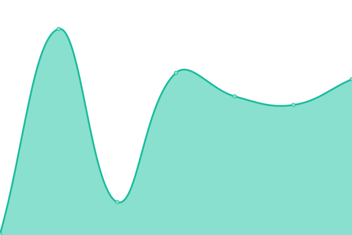

# [📈 Live Status](https://nebulosa-cat.com): <!--live status--> **部分服務中斷**

This repository contains the open-source uptime monitor and status page for [雲豹 ΦωΦ](https://nebulosa-cat.com), powered by [Upptime](https://github.com/upptime/upptime).

With [Upptime](https://upptime.js.org), you can get your own unlimited and free uptime monitor and status page, powered entirely by a GitHub repository. We use [Issues](https://github.com/Nebulosa-Cat/upptime/issues) as incident reports, [Actions](https://github.com/Nebulosa-Cat/upptime/actions) as uptime monitors, and [Pages](https://nebulosa-cat.com) for the status page.

<!--start: status pages-->
<!-- This summary is generated by Upptime (https://github.com/upptime/upptime) -->
<!-- Do not edit this manually, your changes will be overwritten -->
<!-- prettier-ignore -->
| URL | Status | History | Response Time | Uptime |
| --- | ------ | ------- | ------------- | ------ |
|  [Nebulosa Cat's Blog](https://nebulosa-cat.com) | Service Down | [nebulosa-cat-s-blog.yml](https://github.com/Nebulosa-Cat/upptime/commits/HEAD/history/nebulosa-cat-s-blog.yml) | 

 870ms
     
 | 

<a href="https://status.nebulosa-cat.com/history/nebulosa-cat-s-blog">99.99%</a>
    

|  Discord BOT 西宮結弦 | Online | [discord-bot.yml](https://github.com/Nebulosa-Cat/upptime/commits/HEAD/history/discord-bot.yml) | 

 168ms
     
 | 

<a href="https://status.nebulosa-cat.com/history/discord-bot">100.00%</a>
    

|  TDC AdGuard Home | Service Down | [tdc-ad-guard-home.yml](https://github.com/Nebulosa-Cat/upptime/commits/HEAD/history/tdc-ad-guard-home.yml) | 

 1181ms
     
 | 

<a href="https://status.nebulosa-cat.com/history/tdc-ad-guard-home">99.84%</a>
    

<!--end: status pages-->

[**Visit our status website →**](https://nebulosa-cat.com)

## 📄 License

- Powered by: [Upptime](https://github.com/upptime/upptime)
- Code: [MIT](./LICENSE) © [雲豹 ΦωΦ](https://nebulosa-cat.com)
- Data in the `./history` directory: [Open Database License](https://opendatacommons.org/licenses/odbl/1-0/)
